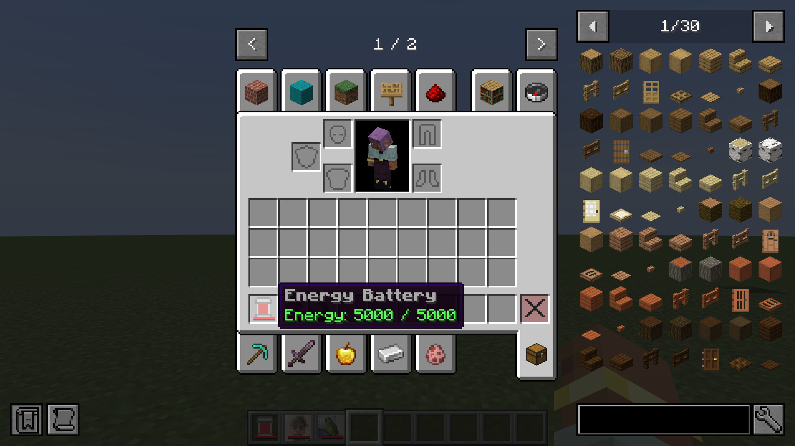
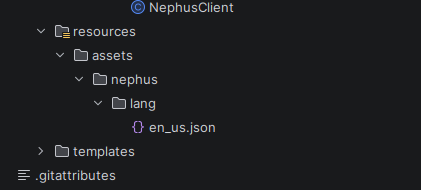
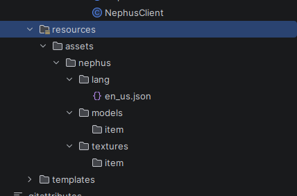
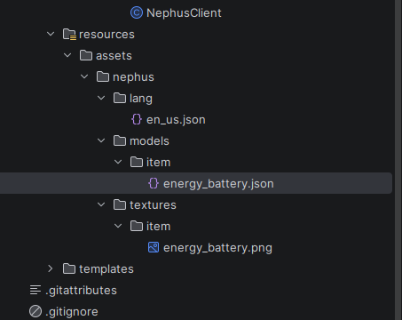
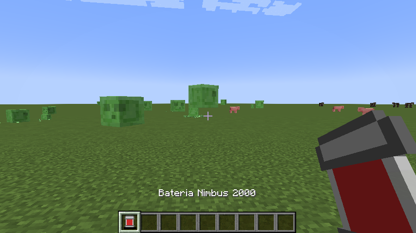

Esse é meu primeiro post aqui no blog, e para começarmos, porque não passar primeiro pelo projeto que estou fazendo atualmente, não é?

Pois bem, eu conheci e jogo Minecraft desde criança quando eu tinha lá meus 8 anos, lá pra época de 2013 para o que eu me recordo, e se tem uma coisa que me chamou atenção no jogo, era principalmente a liberdade e a criatividade dos jogadores em criar diversos modos de jogos, naquele tempo, o Hide-and-Seek era popular e muitos servidores rodavam na versão **1.6.2** ou **1.6.3** e eram muito divertidos.

De lá pra cá, eu comecei a explorar cada vez mais das opções que o jogo oferecia, até chegar no que eu mais amo do jogo até hoje: os mods. Nas versões **1.2.5**, **1.5.2**, **1.6.4** e em diante, eu testei vários mods que me fizeram colocar o jogo como meu preferido até os dias atuais, como o Digimobs, Galacticraft, Pokecube, IndustrialCraft, Morph, entre vários outros.

Eu ainda tentei aprender Java, lá em 2014, mas assim, eu tinha 8 anos, e aprender algo para diversão, principalmente uma linguagem de programação relativamente complexa para depois aprender um ecossistema completo de modificações para um jogo... Certamente não é toda criança que consegue, e eu preferi ir fazer um apocalipse no GTA San Andreas mesmo.

Como eu sou estudante de Ciência da Computação e aprendi Java na minha universidade, então recentemente resolvi tentar novamente meu "sonho". Nesse post vou tentar contar minha experiência como eu consegui e ao mesmo tempo ensinar a você leitor como você pode começar também.

## Por que NeoForge 1.21.1?

Eu falei que eu não ia enrolar mais, mas eu estava mentindo. Eu inicialmente comecei a ideia de fazer o projeto na versão mais recente do Minecraft atualmente (**26.1.2**), mas durante cada atualização de versão do jogo e também do Modloader, muitos métodos e formas de fazer algo mudam completamente, isso leva tempo para a comunidade aprender e transformar mesmo com a [documentação oficial do projeto](https://docs.neoforged.net/).

Mesmo com o uso de IA, muito do conteúdo que ela se baseava, ainda era mais antigo e ficar consertando as mudanças ia me dar ainda mais trabalho, ou seja, preguiça. Então eu resolvi trocar para uma versão mais estável do jogo, a versão **1.21.1**. Querida por muitos, e o último pontapé da comunidade para a maioria dos modders aprenderem e desenvolverem ainda mais o ecossistema das versões mais recentes.

## O que eu precisei antes de começar

> **ATENÇÃO:** Esse artigo não é um tutorial de Java, e é necessário possuir algum conhecimento na linguagem, se você não possui, muito do conteúdo aqui vai parecer que foi retirado de um livro de magia de Harry Potter.

Para começarmos, eu vou dar um overview de tudo que precisamos:
+ [IntelliJ IDEA](https://www.jetbrains.com/idea/)
+ [Minecraft Development Extension](https://plugins.jetbrains.com/plugin/8327-minecraft-development)
+ [Java 21](https://adoptium.net/pt-BR/temurin/releases?version=21)

Não é necessário nenhuma configuração específica de cada uma, apenas instalar. Com tudo isso já instalado e configurado, podemos seguir em frente.

## Gerando o projeto

Para evitar ter que configurar tudo manualmente que é extremamente chato, o NeoForged disponibiliza um [gerador de projetos](https://neoforged.net/mod-generator/) que já cria toda a estrutura inicial pronta pra uso.


Ao abrir o site, você vai ver um formulário com algumas opções. Aqui estão as principais que eu utilizei:

+ **Mod Name:** N.E.P.H.U.S (quem conhece, sabe.)
+ **Mod ID:** nephus
+ **Package Name:** com.nephus.mod
+ **Minecraft Version:** 1.21.1
+ **Gradle Plugin:** ModDevGradle

Pra quê serve cada coisa? Não importa e não é nada tão importante, se quiser saber mais, apenas pesquise mais sobre para aprender, mas uma dica: o Mod ID será muito utilizado, então mantenha um nome simples. Após fazer tudo, só baixar o arquivo .zip, extrair e importar o diretório para o IntelliJ.

## Entendendo a estrutura do projeto

Quando você abre o projeto pela primeira vez, dá um susto. Parece muita coisa, mas boa parte é só estrutura padrão.

Aqui estão os pontos que mais importam no início:

+ `src/main/java`: onde fica o código Java do mod.
+ `src/main/resources`: onde ficam arquivos de dados, texturas, modelos, traduções e outros metadados.
+ `build.gradle`: configuração de build, dependências e versão.
+ `gradle.properties`: propriedades do projeto, como versões e nome do mod.

Nesse artigo, não iremos utilizar ou explicar os dois últimos arquivos aí, eu fiquei tentando entender tudo de uma vez e isso foi um erro. O que realmente funcionou pra mim foi: pegar uma coisa pequena e fazer ela funcionar de ponta a ponta, como não tive que passar por isso aqui, você também não vai!

## Mod técnico é difícil, né? Na verdade, é bem pior do que eu pensava...

Como esse post é meu, e eu faço o que eu quero, eu vou focar no que eu já fiz de um mod técnico, uma bateria de energia, e para isso vamos criar um item chamado `EnergyBattery`.

### Criando o Item `EnergyBattery`


Para criarmos o Item, primeiramente, eu tive que criar um package chamado `item` no diretório principal e em seguida, criei uma classe chamada `EnergyBattery`.

Nela, extendemos nossa classe através do objeto `Item`, um objeto padrão do jogo que usamos como base para todo e qualquer item que criarmos. Após isso, eu sobrescrevi alguns métodos da classe principal e o resultado ficou assim:

```java
package com.aiard0.nephus.item;

// Classe base de item do Minecraft
import net.minecraft.world.item.Item;
// Representa uma instância do item no inventário/mundo
import net.minecraft.world.item.ItemStack;
// Componente customizado onde a energia é armazenada no item
import com.aiard0.nephus.registry.ModDataComponents;

// Nosso item de bateria de energia
public class EnergyBattery extends Item {

    // Capacidade máxima da bateria (energia total suportada)
    private static final int capacity = 5000;

    // Construtor padrão do item
    public EnergyBattery(Properties properties) {
        // Repassa as propriedades para a classe Item (stack size, raridade, etc.)
        super(properties);
    }

    // Getter estático para reutilizar a capacidade em outros pontos do código
    public static int getCapacity() {
        return capacity;
    }

    @Override
    public boolean isBarVisible(ItemStack stack) {
        // Sempre exibe a barrinha abaixo do item no inventário
        return true;
    }

    @Override
    public int getBarWidth(ItemStack stack) {
        // Lê a energia armazenada no Data Component; se não existir, usa 0
        int stored = stack.getOrDefault(ModDataComponents.ENERGY_COMPONENT.get(), 0);

        // Sem energia = sem barra
        if (stored <= 0) {
            return 0;
        }
        // Com energia cheia = barra completa (13 é o máximo no Minecraft)
        if (stored >= getCapacity()) {
            return 13;
        }

        // Calcula o tamanho proporcional da barra entre 0 e 13
        return stored * 13 / getCapacity();
    }
}
```

Ai você me pergunta: pra que serve esse código? E eu te respondo: leia. Simples assim, mas pra resumir o funcionamento:

+ `EnergyBattery(Properties properties)`: cria o item e aplica as propriedades base definidas no registro (aqui não tem nenhuma).
+ `getCapacity()`: retorna a capacidade máxima da bateria (neste caso, 5000).
+ `isBarVisible(ItemStack stack)`: força a barra de energia a aparecer no item no inventário.
+ `getBarWidth(ItemStack stack)`: calcula o tamanho da barra com base na energia armazenada (de 0 a 13).

Agora que todo o scaffolding da nossa `EnergyBattery` está feito, existe algo essencial que ainda não expliquei: o **Data Component**.

### Criando um `Data Component` de energia

De forma rápida, o Data Component é o lugar onde a gente guarda dados customizados do item de forma oficial no Minecraft (desde a versão 1.20.5). No nosso caso, ele guarda a energia da bateria.

Ele é extremamente necessário para qualquer item que manipule energia. Sem ele, a barra até pode existir no código, mas não teria um valor confiável e individual para ler e mostrar. Com ele, cada `ItemStack` da bateria consegue salvar e recuperar a própria carga, e por isso o método `getBarWidth` funciona do jeito certo.

> Para os burros que nem eu: isso garante que cada bateria que você tiver no inventário vai ter sua própria energia, simples e mágico, não é?

Pois bem, eu criei um package `registry`, onde concentramos vários registros que devem ser anexados a inicialização do jogo, e dentro do mesmo, criei a classe `ModDataComponents`, aqui está o resultado:

```java
package com.aiard0.nephus.registry;

// Classe principal do mod (usada para acessar o MODID)
import com.aiard0.nephus.Nephus;
// Codec usado para serializar/desserializar tipos simples (aqui, Integer)
import com.mojang.serialization.Codec;
// Tipo base de um Data Component
import net.minecraft.core.component.DataComponentType;
// Registro global de tipos de componentes de dados do Minecraft
import net.minecraft.core.registries.Registries;
// Codec de rede para sincronização via pacote
import net.minecraft.network.codec.ByteBufCodecs;
// Barramento de eventos do mod (onde registramos os componentes)
import net.neoforged.bus.api.IEventBus;
// Referência "adiada" para o objeto registrado
import net.neoforged.neoforge.registries.DeferredHolder;
// Sistema de registro seguro do NeoForge
import net.neoforged.neoforge.registries.DeferredRegister;

// Classe responsável por registrar todos os Data Components do mod
public class ModDataComponents {

    // Cria o registrador específico de Data Components do mod "nephus"
    private static final DeferredRegister.DataComponents DATA_COMPONENTS =
            DeferredRegister.createDataComponents(Registries.DATA_COMPONENT_TYPE, Nephus.MODID);

    // Método chamado no bootstrap do mod para efetivar os registros no EventBus
    public static void register(IEventBus modEventBus) {
        DATA_COMPONENTS.register(modEventBus);
    }

    // Registra um componente chamado "energy" com tipo Integer
    // Esse componente é o valor que guarda a energia de cada ItemStack da bateria
    public static final DeferredHolder<DataComponentType<?>, DataComponentType<Integer>> ENERGY_COMPONENT =
            DATA_COMPONENTS.registerComponentType("energy", builder ->
                    builder
                // Permite salvar esse valor em disco (mundo/inventário)
                            .persistent(Codec.INT)
                // Permite sincronizar esse valor entre servidor e cliente
                            .networkSynchronized(ByteBufCodecs.INT)
            );
}
```

Acredita que esse código pode ser encontrado de maneira pura (sem alterações complexas) em vários mods grandes por aí? Eu sei disso porque tive que entender pra que servia e como implementar copiando dos outros né...

Mesmo o código estando comentado, aqui está o resumo da importância de cada um:

+ `ModDataComponents`: É o "catálogo" dos componentes de dados do mod. Sempre que eu precisar criar outro dado customizado (por exemplo, carga, modo, nível etc.), é aqui que vou registrar.
+ `DATA_COMPONENTS`: É um registrador especializado do NeoForge para `DataComponentType`. Ele garante que o registro aconteça na hora correta da inicialização do jogo.
+ `register(IEventBus modEventBus)`: É um método conecta esse registrador ao ciclo de vida do mod. Se esse método não for chamado na classe principal, o componente simplesmente não existe em runtime, logo, não vai funcionar nada.
+ `ENERGY_COMPONENT`: É o componente em si, identificado internamente pelo nome `energy`. Esse nome é a chave usada pelo jogo para localizar e armazenar o valor.
+ `.persistent(Codec.INT)`: Isso diz ao Minecraft para salvar esse valor no disco (mundo/inventário). Sem isso, a carga poderia se perder ao fechar e abrir o jogo.
+ `.networkSynchronized(ByteBufCodecs.INT)`: Serve para sincronizar o valor entre servidor e cliente. Sem essa parte, o valor poderia ficar diferente entre os lados, gerando barra errada ou comportamento inconsistente.

Existem muitos outros tipos de `Data Component`, além de podermos criar nossos próprios, mas não é o importante agora porque só precisamos do de energia.

> AVISO: Não se esqueça de voltar lá no nosso `EnergyBattery` e importar o nosso `ModDataComponents`, que não tinha sido criado.

Essa foi uma das partes que mais me confundiu para aprender, eu simplesmente achava que só usariamos uma API pronta, chamava no item que criamos e cabô, tá feito, mas não, a gente tem que criar uma classe para dizer que a gente VAI usar energia e ele entende "Ok, já vai avisando 👍". 

É simplesmente impressionante como o ser humano é capaz de facilitar tantas coisas ao mesmo tempo que é capaz de dificultar também... Já dizia Henry David Thoreau:

> _"Nossas invenções costumam ser brinquedos bonitos, que prendem nossa atenção de coisas sérias. São apenas meios melhorados para um fim não melhorado._" - Essa frase foi patrocinada pelo Gemini.

Enfim, agora conseguimos fazer a parte necessária para preencher o código da nossa `EnergyBattery`, mas se iniciarmos o jogo para testar nosso mod, veremos que o item nem sequer aparecerá no jogo, pois não definimos ID nem registramos ele na inicialização, só fizemos criar classes para o item em si e persistência dos dados.

A esse ponto do post, eu provavelmente já perdi a sua atenção, mas vou fingir que você chegou aqui com muito entusiasmo, e vamos para a próxima etapa: fazer o registro da nossa bateria na inicialização, chamado `ModItems`.

### Criando nosso registrador de itens, o `ModItems`

Ainda dentro do package `registry`, criamos a classe `ModItems`, nela configuramos e adicionamos os itens que criamos para que os mesmos possam ser inicializados no jogo e assim a gente possa segurar, usar, etc. Acho que já deu pra entender, então continuemos com o código:

```java
package com.aiard0.nephus.registry;

// Classe principal do mod (usada para pegar o MODID)
import com.aiard0.nephus.Nephus;
// Classe do nosso item customizado (no caso, nossa EnergyBattery)
import com.aiard0.nephus.item.EnergyBattery;
// Ainda não percebeu que esse troço aqui vai estar em todo lugar?
import net.minecraft.world.item.Item;
// Referência adiada para o item registrado
import net.neoforged.neoforge.registries.DeferredItem;
// Sistema de registro seguro do NeoForge
import net.neoforged.neoforge.registries.DeferredRegister;

// Classe responsável pelo registro de todos os itens do mod
public class ModItems {

    // Cria o registrador de itens vinculado ao MODID do mod
    // Tudo que for item do mod passa por esse registrador
    public static final DeferredRegister.Items ITEMS = DeferredRegister.createItems(Nephus.MODID);

    // Registra o item "energy_battery" no jogo
    // "energy_battery" é o ID interno do item (namespaced com nephus:energy_battery)
    // EnergyBattery::new é a fábrica usada para instanciar o item
    // O retorno é um DeferredItem, que só vira o Item real quando o registro é finalizado
    public static final DeferredItem<Item> ENERGY_BATTERY = ITEMS.registerItem(
            "energy_battery",
            EnergyBattery::new
    );

}
```

Mesmo com o código comentado, aqui vai DE NOVO um resumo direto da importância de cada parte caso você não tenha entendido ou prestado atenção aos _maravilhosos_ comentários:

+ `ModItems`: é a classe onde centralizamos o registro de todos os itens do mod.
+ `ITEMS`: é o registrador de itens vinculado ao `MODID`; sem ele, nenhum item seu entra no ciclo de registro.
+ `ENERGY_BATTERY`: é a referência do item registrado, usada depois em receitas, eventos e outras integrações.
+ `"energy_battery"`: é o ID interno do item no jogo, que vira `nephus:energy_battery`.
+ `EnergyBattery::new`: define qual classe Java será instanciada quando o item for criado.
+ `DeferredItem<Item>`: mantém o registro seguro durante a inicialização, evitando acessar o item antes da hora.

Se você não entendeu ainda, não espere que eu magicamente apareça na sua casa e te ensine, faça que nem um Júnior, copie e cole o código. Basicamente tudo aqui serve para criar um registrador geral de itens do nosso mod, e em seguida, adicionamos o nosso item utilizando esse registrador.

É um código curto e simples até, e sua função não foge desse padrão, se quisermos adicionar outro item, como uma bateria maior, depois de criarmos a classe dela só  precisamos copiar o bloco de código dessa inicial, e substituir os relacionamentos com a nova classe que você criar.

Para mais, caso você tenha achado que estava acabando, você está estupidamente enganado, falta tanta coisa ainda que eu não sei nem o que é o próximo tópico.

### Criando o `ModCapabilityEvents` para interoperabilidade

Voltamos novamente para a parte de energia, e dessa vez, aqui trataremos de um ponto muito importante: interoperabilidade. Imagino que você nunca tenha escutado essa palavra na vida se você possui abaixo de 30 anos de idade, e se a conhece, talvez seja porque seu professor de Geografia tenha atazanado você para fazer um trabalho em que o tema envolvesse essa palavra. (Não tem nada pessoal aqui.)

O `ModCapabilityEvents` é o responsável por permitir que nossa `EnergyBattery` possa se comunicar com itens de outros mods sem precisarmos de configurações manuais pra isso. Quando registrado, isso faz com que nossa bateria possa ser carregada por geradores de energia de vários mods diferentes (Mekanism, Powah, entre outros), ou possamos recarregar alguma máquina que aceite uma bateria, no caso, a nossa.

Você ainda não entendeu a diferença dessa porcaria para o `Data Components`? É mais simples do que parece!

+ **Data Components:** É o cara que guarda o valor da energia dentro do item, individualmente. Deixa salvo a energia de cada item, faz com que não se perca o valor.
+ **Capability:** É o cara que expõe a capacidade dessa bateria para que outros mods possam reconhecer e manipular. Permite que cabos, máquinas e outros mods enxerguem a bateria como algo que pode receber/fornecer energia.

Para continuarmos fazendo acontecer, criamos um novo package chamado `events`, e nele criaremos a classe `ModCapabilityEvents`, aqui adicionamos um método que ficará responsável por registrar as Capabilities de cada item que queremos, mas só temos um né, então óbvio qual vai ser. Aqui está o código de como vai ficar:

```java
package com.aiard0.nephus.events;

// Acessa os componentes de dados do mod (onde está o ENERGY_COMPONENT)
import com.aiard0.nephus.registry.ModDataComponents;
// Acessa os itens registrados do mod (para identificar qual item recebe a capability)
import com.aiard0.nephus.registry.ModItems;
// Acesso ao sistema de capabilities do NeoForge
import net.neoforged.neoforge.capabilities.Capabilities;
// Evento disparado na inicialização para registrar capabilities
import net.neoforged.neoforge.capabilities.RegisterCapabilitiesEvent;
// Implementação pronta de armazenamento de energia usando Data Components
import net.neoforged.neoforge.energy.ComponentEnergyStorage;

// Classe responsável por registrar as capabilities de energia dos itens do mod
public class ModCapabilityEvents {

    // Método chamado no bootstrap para registrar a capability energética
    public static void registerCaps(RegisterCapabilitiesEvent event) {
        // Registra a capability de armazenamento de energia para um item específico
        event.registerItem(
                // Tipo de capability que estamos registrando (padrão do NeoForge para itens com energia)
                Capabilities.EnergyStorage.ITEM,
                // Lambda que cria uma nova instância de armazenamento de energia para cada item
                (stack, context) -> new ComponentEnergyStorage(
                        // ItemStack da bateria (o item em si no inventário)
                        stack,
                        // Data Component que armazena o valor de energia dentro do item
                        ModDataComponents.ENERGY_COMPONENT.get(),
                        // Capacidade máxima de energia que a bateria pode guardar
                        5000,
                        // Máximo de energia que pode receber de outras fontes por tique
                        500,
                        // Máximo de energia que pode enviar para outras máquinas por tique
                        500
                ),
                // Item específico que receberá essa capability (nossa EnergyBattery registrada)
                ModItems.ENERGY_BATTERY
        );
    }

}
```

Aqui está o resumo do que cada parte do `ModCapabilityEvents` faz:

+ `ModCapabilityEvents`: É a classe que registra as capabilities de energia para os itens do mod, se você não sabe o que faz, leitura não parece ser seu ponto forte.
+ `registerCaps(RegisterCapabilitiesEvent event)`: Método chamado na inicialização que efetivamente registra a capability de armazenamento de energia.
+ `Capabilities.EnergyStorage.ITEM`: É o tipo de capability que estamos registrando — a capability padrão do NeoForge para itens que armazenam energia.
+ `ComponentEnergyStorage`: A implementação pronta que conecta nosso Data Component (`ENERGY_COMPONENT`) ao sistema de energia do NeoForge.
+ Parâmetros de capacidade:
  - `5000`: Capacidade máxima de energia que a bateria pode armazenar, lembre-se: esse número deve ser igual ao registrado lá na classe `EnergyBattery`, afinal não podem ser valores diferentes
  - `500`: Máximo de energia que a bateria pode receber de outras fontes por tick (máquina, gerador, outro mod).
  - `500`: Máximo de energia que a bateria pode enviar para outras máquinas por tick.
+ `ModItems.ENERGY_BATTERY`: Identifica especificamente qual item (nossa bateria) receberá essa capability de energia, permitindo que o NeoForge saiba exatamente a qual item aplicar essa funcionalidade.

> No Minecraft, a menor divisão de tempo são os ticks ou TPS (ticks por segundo) e apenas 1 segundo é o equivalente a 20 ticks. Se colocamos que a entrada máxima de energia por tick é 500, então em 1 segundo, ela deve receber 10.000 de energia nesse 1 segundo. 

>(500 x 20 = 10000, pode acreditar, eu sei matemática)

Se você é um bom desenvolvedor ou estudante prodígio de uma universidade do interior do Estado do Piauí, já deve ter percebido que muitos dos códigos vistos aqui possuem escolhas e redundância bem questionáveis, mas sinto que devo dizer que tenho consciência dos erros e que os mesmos são totalmente propositais, ou talvez nem tanto. Os exemplos dessa forma tornam mais legíveis a maneira de visualizar os valores entre os mesmos que não prestam atenção nos resumos.

Um exemplo poderia ser nosso valor responsável pela capacidade máxima, `5000`, que para evitar ambas constantes não sincronizadas (na bateria e no capability), poderíamos substituir por `EnergyBattery.getCapacity()`, assim apenas a troca de 1 único valor seria o suficiente para evitar falta de atenção e seus problemas provenientes no futuro, mas errar é humano, e nada melhor do que ensinar errando, esse post já é um erro.

Enfim, diria que 90% do trabalho aqui está feito, mas após criarmos TUDO ISSO, significa que quando executarmos o jogo e formos testar nosso mod, tudo estará funcionando? Claro que não! 😁

### Registrando nossas alterações na classe principal do mod

Calma, já estamos terminando pequeno gafanhoto. Para essa etapa aqui, só precisamos registrar nossas diversas classes criadas no construtor da classe principal do nosso mod, o arquivo `Nephus`. Pegaremos nosso `ModItems` (registro de itens), nosso `ModDataComponents` (registro persistente para energia) e nosso `ModCapabilityEvents` (a compatibilidade entre mods) e adicionaremos todos eles à classe:

```java
// The constructor for the mod class is the first code that is run when your mod is loaded.
// FML will recognize some parameter types like IEventBus or ModContainer and pass them in automatically.
public Nephus(IEventBus modEventBus, ModContainer modContainer) {
    // Register the commonSetup method for modloading
    modEventBus.addListener(this::commonSetup);

    // Register the Deferred Register to the mod event bus so blocks get registered
    BLOCKS.register(modEventBus);
    // Register the Deferred Register to the mod event bus so items get registered
    ITEMS.register(modEventBus);
    // Register the Deferred Register to the mod event bus so tabs get registered
    CREATIVE_MODE_TABS.register(modEventBus);

    // Register ourselves for server and other game events we are interested in.
    // Note that this is necessary if and only if we want *this* class (NEPHUS) to respond directly to events.
    // Do not add this line if there are no @SubscribeEvent-annotated functions in this class, like onServerStarting() below.
    NeoForge.EVENT_BUS.register(this);

    // ! É AQUI ONDE COLOCAMOS OS REGISTROS!

    ModItems.ITEMS.register(modEventBus);
    ModDataComponents.register(modEventBus);
    modEventBus.addListener(ModCapabilityEvents::registerCaps);

    //

    // Register the item to a creative tab
    modEventBus.addListener(this::addCreative);

    // Register our mod's ModConfigSpec so that FML can create and load the config file for us
    modContainer.registerConfig(ModConfig.Type.COMMON, Config.SPEC);
}
```

Como você pode ver, muito do conteúdo da classe principal já está ocupado com alguns exemplos, como um bloco simples, item simples, etc, mas como não interferem em nada além de serem inúteis, irei mantê-los aí no lugar, assim, no grande construtor `public Nephus(IEventBus modEventBus, ModContainer modContainer)` adicionamos essas 3 seguintes linhas de código:

+ `ModItems.ITEMS.register(modEventBus)`: registra todos os itens do mod no ciclo de inicialização, para que a bateria realmente exista no jogo.
+ `ModDataComponents.register(modEventBus)`: registra os Data Components do mod, incluindo o componente que guarda a energia da bateria.
+ `modEventBus.addListener(ModCapabilityEvents::registerCaps)`: conecta o evento de capabilities ao carregamento do mod, para que a bateria seja reconhecida como um item de energia por outros sistemas, por isso que o código dela é diferente dos outros dois acima.

E assim, finalmente, temos uma bateria 100% funcional no nosso jogo, no vídeo abaixo, temos a maneira que utilizamos para buildar e carregar o jogo com nosso mod instalado:



E aqui, temos a gente pegando nosso item por comando para testar se ele realmente está no jogo:



### BÔNUS: Adicionando textura ao item e localização

Como você deve ter visto nos vídeos acima, nosso item está no jogo, mas então, o que CARALHOS é essa coisa preta com roxa que vemos no jogo? Pois bem, não adicionamos nenhum modelo ou textura para nosso item, então para ele ter um aspecto legal como aquelas baterias que vemos nos grandes mods, precisamos criar uma.... E eu criei uma, aqui está ela:


Ela está minúscula na sua tela, não é? Pois é, na minha também! O modelo do item deve ser uma textura em formato PNG com 16x16 pixels de tamanho (ou múltiplos, como 32x32, 64x64, em diante). Então, e agora? Como fazemos para podermos adicionar ao jogo?

> DICA: Eu utilizei o [Blockbench](https://www.blockbench.net/) para projetar a textura, é mais fácil de exportar e simples de fazer a textura por lá, mas qualquer outro software serve para o trabalho, desde o Paint do seu Windows XP até o Photoshop, enquanto você mantiver os requisitos acima.

Para isso, precisamos adicionar algumas pastas ao diretório ``resources`` do nosso projeto, nessa pasta que ficam coisas como modelos, texturas e arquivos de localização (ou tradução, pra os desafortunados de conhecimento).

É assim que está o diretório sem modificações:



Vamos criar alguns diretórios novos, entre eles, o `models` e o `textures`, e dentro de cada um deles criamos um diretório chamado `item`, assim deve ficar igual a isso aqui:



Agora com esses diretórios prontos, vamos começar criando o nosso arquivo de modelo, mas antes de tudo, vamos explicar a diferença de modelo e textura:

+ **`models`**: É o arquivo que diz para o Minecraft como o item deve ser desenhado. Ele define a estrutura lógica da textura do item, apontando qual usar e como ela deve aparecer no jogo.

+ **`textures`**: é a imagem em si, normalmente um PNG, que vai ser aplicada nesse modelo. Em outras palavras: o modelo é o "molde" e a textura é a "arte" colocada nesse molde.

No caso de um item simples, como nossa humilde bateria, o modelo costuma ser bem pequeno e só serve para ligar a imagem certa ao item certo. Já a textura é o que realmente dá a aparência visual da bateria dentro do inventário. 

Vamos criar o arquivo `energy_battery.json` dentro do diretório `models/item`, e vamos popular com o seguinte código:

```json
{
  "parent": "minecraft:item/generated",
  "textures": {
    "layer0": "nephus:item/energy_battery"
  }
}
```

É bem simples, apenas um arquivo `json` com um código que ligue o ID certo do nosso item, lembrando que lá no código que registram os itens ao jogo, definimos o ID como `energy_battery`, então os nomes dos arquivos e suas citações devem conter o mesmo nome.

Em seguida, só adicionarmos a textura que criamos no diretório `textures/item`, claro, respeitando com nome sempre batendo certo com o ID do item, como `energy_battery.png`. Após tudo, os diretórios ficarão dessa maneira:



Por último, precisamos adicionar uma localização ao nosso item, no vídeo, ele estava com o nome do estranho parecendo um código asteca, mas na verdade ele apenas não possuía um nome localizado, a localização geral de todos os mods é o Inglês, e no diretório `lang` é onde ficam os arquivos de tradução, todos em `json` e no arquivo padrão `en_us.json`, é onde adicionamos o nome do nosso item, que aparecerá quando o pegarmos e no inventário, aqui está o código:

```json
{
  "itemGroup.nephus": "Example Mod Tab",
  "block.nephus.example_block": "Example Block",
  "item.nephus.example_item": "Example Item",

  "item.nephus.energy_battery": "Bateria Nimbus 2000",

  "nephus.configuration.title": "N.E.P.H.U.S Configs",
  "nephus.configuration.section.nephus.common.toml": "N.E.P.H.U.S Configs",
  "nephus.configuration.section.nephus.common.toml.title": "N.E.P.H.U.S Configs",
  "nephus.configuration.items": "Item List",
  "nephus.configuration.logDirtBlock": "Log Dirt Block",
  "nephus.configuration.magicNumberIntroduction": "Magic Number Text",
  "nephus.configuration.magicNumber": "Magic Number"
}
```

A chave `item.nephus.energy_battery` representa nosso item no jogo, então só seguindo esse formato e colocando uma `string` qualquer na frente e seguindo o padrão comum dos arquivos `json`, traduziremos o item facilmente. Ou não, depende de você também né.

Com nossa maravilhosa Bateria Nimbus 2000 adicionada, se abrirmos o jogo vamos ter um maravilhoso resultado, nossa bateria vai ter um nome legal e uma textura funcional que nem parece ter sido roubada da internet:



Agora, utilizando os cataventos e a bateria do Mekanism, vemos se tanto nossa bateria está funcionando e recebendo/depositando energia, e se é compatível com outros mods:



Simplesmente uma das 7 maravilhas do mundo moderno.

## Conclusão, se é que dá pra chamar assim depois de milênios passados

Bem, como você pode ver, faltou algumas coisas, como uma forma de visualizar a energia da bateria, criar receitas, adicionar blocos mais complexos, mas acho que você e eu já estamos cansados o suficiente para ler um artigo com assunto feito dessa loucura. Caso queira uma parte 2 sobre mais assuntos, apesar de que eu já estou adentrando mais nesses, só deixar seu feedback. O repositório desse tutorial está disponível [aqui](https://github.com/Aiard0/mod-tutorial-1.21.1).

Se você conseguiu chegar até aqui lendo tudo isso, e ainda mais, fazendo ou copiando o código junto, e teve um resultado parecido, meus parabéns você perdeu muito tempo da sua vida, mas **muito obrigado ainda assim por ter tentado, e principalmente, por ler meu post**.

O humor é a principal forma de amenizarmos falarmos de determinados assuntos, mesmo eu que adoro tecnologia, não sou muito fã da linguagem de alguns, mas não é uma crítica, e sim uma pergunta: Por que não existir posts de tecnologia com humor?

Se você curtiu esse artigo, pode me dar um feedback do mesmo em qualquer plataforma, principalmente no meu [LinkedIn](https://linkedin.com/in/abdon-werner-454aa6299), planejo fazer alguns outros posts que eu tiver interesse no futuro e cada atualização será postada lá. Esse aqui levou um pouco mais de 1 semana, afinal sou imensamente preguiçoso, mas tento cumprir o que faço.

Enfim, obrigado pela atenção, e até a próxima pessoal. 👋